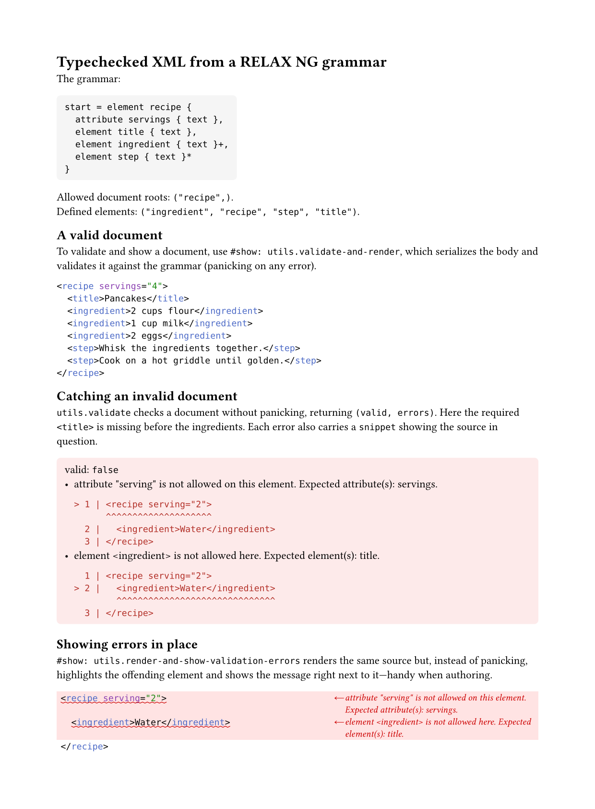

# typst-xmlit

Tools for generating, validating, and outputting XML using Typst syntax.

<p align="center">
  
</p>

The page above is [examples/create-from-relaxng.typ](examples/create-from-relaxng.typ)
rendered by Typst: it derives typechecked element constructors from a RELAX NG
grammar, then validates and prints a document — pointing right at the mistakes
in an invalid one.

## Authoring XML

Create functions which return XML elements with `make-tag`/`make-tags`.
Use the resulting functions using standard typst syntax. Named arguments are converted to attributes and positional arguments
are treated as children.

### `make-tag(tag, handlers: auto) -> function`

Creates a tag function for a single element named `tag`. `handlers` overrides
how body content is converted to XML (see [Markup in bodies](#markup-in-bodies)).
The returned tag function takes named arguments as attributes and positional
arguments as children: `<tag>(..args) -> content`.

### `make-tags(..names, handlers: auto) -> array`

Creates one tag function per name, returned in order for destructuring;
`handlers` is forwarded to each.

```typst
#import "@preview/xmlit:0.1.0": make-tags, xml-to-string

#{
  let (foo, bar) = make-tags("foo", "bar")

  // Typst native XML parsing
  let xml1 = xml(bytes(`<foo><bar baz="zz" />text</foo>`.text))

  // Construct XML by passing using function arguments
  let xml2 = foo(bar(baz: "zz"), "text")

  // Construct XML by passing using a code block
  let xml3 = foo({
    bar(baz: "zz")
    "text"
  })

  // Construct XML by passing content
  let xml4 = foo[#bar(baz: "zz")text]

  [
    // All versions render as `<foo><bar baz="zz" />text</foo>`
    #xml-to-string(xml1)

    #xml-to-string(xml2)

    #xml-to-string(xml3)

    #xml-to-string(xml4)
  ]
}
```

### Markup in bodies

Inside content (`[...]` blocks) markup is automatically converted into tags:

 - `*bold*` → `<b>bold</b>`
 - `_emph_` → `<em>emph</em>`
 - `` `code` `` → `<c>code</c>`
 - `$x^2$` → `<m>x^2</m>`
 - `$ ... $` → `<md>…</md>`

This mapping can be overwritten by providing `handlers` to the make-tag function.

```typst
#import "../src/lib.typ": *

#let p = make-tag("p", handlers: (
  // strong -> <alert> instead of <b>
  "strong": (c, convert, ctx) => ((tag: "alert", attrs: (:), children: convert(c.body)),),
  // Control how the _content_ of math is serialized.
  "math": (body, convert, ctx) => ("MATH: \"" + repr(body) + "\"",),
  // Control what tag is used for math blocks.
  "equation": (c, convert, ctx) => {
    let f = c.fields()
    let tag = if f.block { "md" } else { "m" }
    // Use the math handler we defined already.
    let math-handler = ctx.handlers.at("math")
    ((tag: tag, attrs: (:), children: math-handler(f.body, convert, ctx)),)
  },
))

// Becomes: `<p>A <alert>very important</alert> point about <m>MATH: "attach(base: [x], t: [2])"</m>. It can sometimes be solved with <md>MATH: "root(radicand: [⋅])"</md></p>`
#xml-to-string(p[
  A *very important* point about $x^2$. It can sometimes be solved with
  $
    sqrt(dot)
  $
])
```

A handler has the signature `handler(element, convert, ctx)`
 - `convert` turns any child value (e.g. the element's body) into an array of XML nodes using the
same handler table
 - `ctx` provides an object that can be used to look up other handlers that are defined. They will be defined on `ctx.handlers`.

Unmapped markup (e.g. headings) raises an error naming the element and the
`handlers:` entry that would map it.

#### Preserving Math

There is no way (in typst 0.15) to serialize all math such that `eval`
can evaluate it as valid typst code. Since you may want access to the math (for example,
measure it), the `extract-math: true` option may be passed to `xml-to-string`.
If passed, it returns a dictionary `(xml, math-items)`: all found math is
collected into `math-items` and the math in the XML string is replaced with a
sentinel.

```typst
#let (xml, math-items) = xml-to-string(doc, extract-math: true)
// xml:        "<p>Area: <m>⟦math-0⟧</m></p>"   (text sentinels, ⟦id⟧)
// math-items: ("math-0": $pi r^2$, ...)         (real equation content)

// rendered sizes, keyed by the same ids that appear in the XML:
#context math-items.pairs().map(((id, eq)) => (id, measure(eq)))
```

Ids are assigned in document order ("math-0", "math-1", ...), so they are
deterministic across compiles. The default (no `extract-math`).

See [examples/render-xml-with-math.typ](examples/render-xml-with-math.typ) for an example where
xml is produced with math rendered as "math" via typst.

## Typechecked authoring from a RELAX NG grammar

### `create-from-relaxng(rnc, handlers: auto, wasm: auto) -> dictionary`

`create-from-relaxng` derives tag functions from a RELAX NG grammar (compact
syntax, `.rnc`) and validates the composed document via a bundled WASM
plugin (see [plugin/](plugin/README.md)). It returns
`(elements: dictionary, utils: dictionary)`. Parameters:

- `rnc` — the grammar source (str/bytes), or a `(file-name: contents)`
  dictionary for multi-file grammars (the first entry is the entry point).
- `handlers` — forwarded to every generated tag function.
- `wasm` — the validator plugin; defaults to the bundled one.

```typst
#import "@preview/xmlit:0.1.0": create-from-relaxng

#let (utils, elements) = create-from-relaxng(
  "start = element foo { element bar { attribute baz { text } }* }",
)
#let (foo, bar) = elements

#show: utils.validate-and-render

#foo[#bar(baz: "xx")]
```

The returned dictionary destructures into two entries:

- `elements` — a dictionary mapping each element name defined in the grammar
  to its tag function (destructure the ones you need, as above).
- `utils` — grammar-level helpers, each accepting `pretty-print: false` where
  applicable (see [Pretty printing](#pretty-printing)):
  - `render(body, pretty-print: false) -> content` — a template
    (`#show: utils.render`) that serializes its body and renders the XML
    source *without validating*. Useful for fast iteration; switch to
    `validate-and-render` once the document is ready to be checked.
  - `validate-and-render(body, pretty-print: false) -> content` — a template
    (`#show: utils.validate-and-render`) that serializes its body, validates
    it against the grammar, and renders the XML source. Invalid documents fail
    compilation with a readable panic that includes a small line-numbered
    snippet of the source around each error, not the whole document:

    ```text
    XML failed RELAX NG validation:
    - element <qux> is not allowed here. Expected element(s): bar.
        1 | <foo>
      > 2 |   <qux />
              ^^^^^^^
        3 | </foo>
    ```

    No `(line, column)` is shown — those would be positions in the invisible,
    internally-generated compact XML string, not anything actually written.

    The snippet is windowed both by line (a couple of lines of context) and,
    within the target line itself, by character count — pretty-printing only
    breaks lines between all-element children, so a `<p>` full of prose (or
    even a whole document with no element-only nesting) can pretty-print to
    one very long line; the character-level window is what keeps the snippet
    short regardless.

    Use `.with(pretty-print: true)` in a show rule:
    `#show: utils.validate-and-render.with(pretty-print: true)`.

  - `render-and-show-validation-errors(body, pretty-print: true) -> content` —
    a template (`#show: utils.render-and-show-validation-errors`) for
    authoring/preview: like `validate-and-render`, but instead of panicking on
    an invalid document it renders the XML source anyway, highlighting each
    offending element's line in place with its error message. Errors that
    can't be tied to a specific element are listed below the block. Useful
    while iterating on a document you know isn't finished yet.
  - `validate(doc) -> (valid: bool, errors: array)` — validate content or an
    XML string without panicking. On failure, each entry in `errors` also
    carries a `snippet` — the same windowed source excerpt used in
    `validate-and-render`'s panic message (`none` only for errors with no
    locatable position, e.g. an internal buffer-limit error). For a raw `doc`
    string the snippet windows directly around the error's position in that
    string (no round-trip through the grammar needed), and the plugin's raw
    `line`/`column` fields are kept, since they index the exact string
    written. For authored content the snippet is mapped through the element
    that produced it, and `line`/`column` are *removed* — those would be
    positions in an invisible, internally-generated XML string, not anything
    actually written, so they'd only mislead.
  - `roots` — the element names allowed as the document root. (All element
    names are `elements.keys()`.)

A `handlers:` argument passed to `create-from-relaxng` is forwarded to every
generated tag function, so one handler table configures markup/math
conversion for the whole grammar (see [Markup in bodies](#markup-in-bodies)).

## Serializing

### `xml-to-string(node, handlers: auto, extract-math: false, pretty-print: false) -> str | dictionary`

`xml-to-string` accepts authored trees (the return value of a tag function or
any markup content), plain node dictionaries/strings/arrays, and — faithfully —
the output of Typst's built-in `xml()` reader. Parameters:

- `node` — an authored tree, a node dict/str/array, or `xml()` reader output.
- `handlers` — overrides for content conversion (see [Markup in bodies](#markup-in-bodies)).
- `extract-math` — return a `(xml, math-items)` dictionary with equations pulled out (see below).
- `pretty-print` — indent element-only content (see below).

```typst
#xml-to-string(xml("doc.xml"))
```

Attribute order is preserved, text/attribute contexts are escaped correctly,
empty elements self-close, and default-namespace declarations are re-emitted
only where the namespace actually changes.

### Pretty printing

Pass `pretty-print: true` to indent the output. Only elements whose children
are *all elements* are reflowed — one child per line; elements containing any
text (mixed content) stay inline, so no significant whitespace is introduced:

```typst
#xml-to-string(root(a(b()), b(id: "2")), pretty-print: true)
// <root>
//   <a>
//     <b />
//   </a>
//   <b id="2" />
// </root>

#xml-to-string(p[Some *bold* text], pretty-print: true)
// <p>Some <b>bold</b> text</p>   (mixed content — left inline)
```

Pretty-printed output is meant for reading; it is not byte-faithful to
`xml()` reader input.

## Development

Clone with submodules (the RELAX NG plugin vendors its Rust dependencies):

```sh
git clone --recursive <repo>
# or, after a plain clone:
git submodule update --init --recursive
```

The dev container ships everything needed: `typst`, `tt` (tytanic), the Rust
toolchain with the `wasm32-unknown-unknown` target, and `wasm-opt` (binaryen).

### Tests

The suite has four layers:

1. **Unit tests** — `tests/<name>/test.typ`, discovered and run by
   [tytanic](https://github.com/typst-community/tytanic). They are
   assert-based, compile-only tests: a test passes iff it compiles.

   ```sh
   tt list             # show the suites
   tt run              # run everything
   tt run relaxng      # run one suite
   ```

   The `relaxng-pretext` and `relaxng-prefig` suites exercise the real
   PreTeXt and PreFigure grammars (fixtures and provenance in
   `tests/grammars/`).

2. **Expected failures** — `tests/expect-fail/*.typ`. Each file must FAIL to
   compile with the specific error named in its header comment. Deliberately
   not named `test.typ`, so tytanic ignores them; check them with the loop in
   `tests/expect-fail/README.md`.

3. **Examples** — every `examples/*.typ` must compile cleanly, so the
   documented usage can't silently drift from the API.

4. **Visual smoke tests** — co-located `src/**/*.test.typ` files. Compile one
   and eyeball the output:

   ```sh
   typst compile --root . src/relaxng/relaxng.test.typ out.pdf
   ```

Layers 1–3 all run via `tests/run.sh` (which `tt run` covers for layer 1
only); the plugin also has native Rust tests:
`cd plugin/typst-relaxng && cargo test`.

### Rebuilding the WASM plugin

The compiled plugin is committed at `src/relaxng/relaxng.wasm`; rebuild it
after changing `plugin/typst-relaxng`:

```sh
plugin/build.sh    # build + wasm-opt + install into src/relaxng/
```

See [plugin/README.md](plugin/README.md) for the architecture, the
chrono/regex shims, and binary-size notes.
